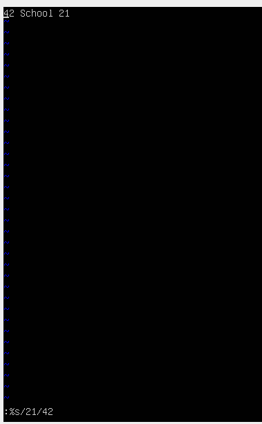
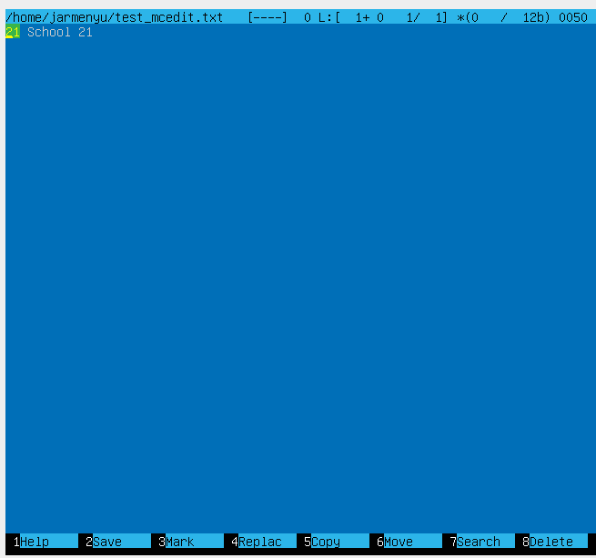

# Part 1
## Узнаем версию Ubuntu, выполнив команду cat /etc/issue
  

# Part 2
## Создания пользователя
  
## Пользователь в выводе команды cat /etc/passwd
  
## Пользователь добавлен в группу adm
  

# Part 3
## При вызове команды hostname отображается имя tester, заданное при установке ОС. С помощью команды sudo hostnamectl set-hostname user-1 название машины измения на user-1.
  
## При повторном вызове hostname получаем новое название - user-1.
  
## Далее, проверим текущюю временную зону.
  
## Установим временную зону Europe/Moscow и выполним проверку.
   
## Выведем названия сетевых интерфейсов с помощью консольной команды ip address.
   
***lo (loopback device) — это виртуальный сетевой интерфейс, который используется для сетевой связи внутри самой машины. Он играет важную роль в тестировании и диагностики сетевых приложений, а также в работе локальных служб.***
## Используя консольную команду cat /var/log/syslog | grep -i 'dhcp', получим ip адрес устройства, на котором оно работает, от DHCP сервера
   
***DHCP — протокол прикладного уровня модели TCP/IP, служит для назначения IP-адреса клиенту. Это следует из его названия — Dynamic Host Configuration Protocol. IP-адрес можно назначать вручную каждому клиенту, то есть компьютеру в локальной сети. Но в больших сетях это очень трудозатратно, к тому же, чем больше локальная сеть, тем выше возрастает вероятность ошибки при настройке. Поэтому для автоматизации назначения IP был создан протокол DHCP.***
## Определить и вывести на экран внешний ip-адрес шлюза (ip) и внутренний IP-адрес шлюза, он же ip-адрес по умолчанию (gw).
   
***Шлюз - это один из типов маршрутизаторов. Маршрутизаторы соединяют несколько сетей и выполняют функции маршрутизации пакетов. Шлюзы осуществляют маршрутизацию на сетевом уровне.***
### Внутренний ip-адрес можно узнать следующим способом.
   
***Как внешний, так и внутренний ip-адреса предназначены для одной цели, но разница в области видимости. Внешний адрес шлюза используется по всему Интернету, когда внутренний используется только в приватной сети к устройстам, подключенным к ней.***
## Затем перейдем к файлу конфигурации Netplan. В данном случае это файл 00-installer-config.yaml.
   
### Зададим статические настройки.
   
## Для применения изменений используем команду netplan apply
   
## Успешно пропинговать удаленные хосты 1.1.1.1 и ya.ru и вставить в отчёт скрин с выводом команды. В выводе команды должна быть фраза "0% packet loss".
   

# Part 4
## Выполним sudo apt update и sudo apt upgrade
   

# Part 5
## Наделим пользователя правами sudo.
   
## Сменим пользователя на hozyain.
   
## Выполним изменение названия машины и проверку сохранения изменений. После этого вызовем reboot.
   
   
***Команда sudo - substitute user and do, подменить пользователя и выполнить. Главное назначение sudo — это выполнить команду от имени другого пользователя, обычно от root. Смысл выполнения команды от root в том, что у него повышенные права доступа и, применяя sudo, обычный пользователь может выполнить те действия, на которые у него недостаточно прав.***

# Part 6
## Настройки часового пояса.
   

# Part 7
## Установка текстовых редакторов.
- sudo apt install vim
- sudo apt install nano
- sudo apt install mcedit
## Запись никнейма в файлы и закрытие с сохранением
- VIM
   
***Для выхода с сохранением нужно нажать Esc, затем написать :wq***
- Nano
   
***Для выхода с сохранением нужно выполнить Ctrl+S и Ctrl+X***
- MCEDIT
   
   
***Для выхода с сохранением необходимо нажать F10 и выбрать yes***
## Запись текста "21 School 21" в файлы и выход без сохранения
- VIM
   
   
***Для выхода без сохранения нужно нажать Esc, затем написать :q!***
- Nano
   
   
***Для выхода без сохранения нужно нажать Esc, затем Ctrl + X***
- MCEDIT
   
   
   
***Для выхода без сохранения нужно нажать F10, затем выбрать No***
## Поиск по слову в файлах
- VIM
**Поиск: Esc + /<word_to_search>**
   
**Замена: :%s/<change_this>/<to_this>**
   
- Nano
**Поиск: Ctrl + W**
   
   
**Замена: Ctrl + \ **
   
   
- MCEDIT
**Поиск: F7**
   
   
**Замена: F4**
   
   
   

# Part 8
## Автоматически SSHd автостарт службы добавлен при загрузке системы
   
## Изменить автостарт можно с помощью команд sudo systemctl disable ssh
   
## Для перенастройки службы SSHd откроем файл sshd_config командой sudo nano /etc/ssh/sshd_config
   
## По умолчанию порт задан 22. Изменим на 2022
   
## Используя команду ps, покажем наличие процесса sshd
   
***ax – будут показаны все процессы подробно. u — выводит пользователя и еще доп информацию. grep sshd выводит только те строчки, где есть sshd***
## Выполним reboot и netstat -tan
   
***Команда netstat используется для отображения сетевых соединений, таблиц маршрутизации, интерфейсов и различных сетевых статистик. В данном случае, команда netstat -tan используется для вывода информации о активных сетевых соединениях.***
***-t: Показать только соединения по протоколу TCP. -a: Показать все соединения, включая прослушивающие порты. -n: Показать IP-адреса и номера портов в числовом формате, без попытки разрешения имен хостов и служб.***
***Proto: Протокол, используемый для соединения (например, TCP).***
***Recv-Q: Количество байт, ожидающих получения локальным хостом.***
***Send-Q: Количество байт, ожидающих отправки на удаленный хост.***
***Local Address: Локальный адрес и порт, используемые для соединения.***
***Foreign Address: Удаленный адрес и порт, используемые для соединения.***
***State: Состояние соединения (например, LISTEN, ESTABLISHED).***
***Адрес 0.0.0.0 в поле Local Address означает, что сервер прослушивает соединения на всех сетевых интерфейсах. Это может включать как локальные, так и внешние интерфейсы. Если в поле Foreign Address указан адрес 0.0.0.0, это значит, что соединение может быть установлено с любого удаленного адреса.***

# Part 9
## Команда top
   
**Основные параметры системы:**
1) Uptime: Система работает 26 минут.
2) Количество авторизованных пользователей: 1 пользователь.
3) Общая загрузка системы: 0.00, 0.00, 0.00 (средняя загрузка за последние 1, 5 и 15 минут).
4) Общее количество процессов: 94 процесса (1 running, 93 sleeping, 0 stopped, 0 zombie).
5) Загрузка CPU:
- us: 0.0% (время, потраченное на выполнение пользовательских процессов).
- sy: 0.0% (время, потраченное на выполнение системных процессов).
- ni: 0.0% (время, потраченное на выполнение процессов с измененным приоритетом).
- id: 100.0% (время простоя CPU).
- wa: 0.0% (время ожидания операций ввода-вывода).
- hi: 0.0% (время обработки аппаратных прерываний).
- si: 0.0% (время обработки программных прерываний).
- st: 0.0% (время, украденное гипервизором).
6) Загрузка памяти:
- Общая память: 3920.2 MiB.
- Свободная память: 3416.5 MiB.
- Использованная память: 139.4 MiB.
- Буфер/кэш: 364.3 MiB.
7) Размер swap:
- Общий: 3010.0 MiB.
- Свободный: 3010.0 MiB.
- Использованный: 0.0 MiB.
8) PID процесса, занимающего больше всего памяти:
- PID: 1
- Команда: systemd
- Память: 0.3%
9) PID процесса, занимающего больше всего процессорного времени:
- PID: 1
- Команда: systemd
- Время CPU: 0.92 (время, потраченное на выполнение процесса с момента его запуска).
## Команда htop
**htop, отсортированный по PID**
   
**htop, отсортированный по PERCENT_CPU**
   
**htop, отсортированный по PERCENT_MEM**
   
**htop, отсортированный по TIME**
   
**htop, отфильтрованный для процесса sshd**
   
**htop с процессом syslog**
   
**htop с добавленным выводом hostname, clock и uptime**
   

# Part 10
## Команда fdisk -l.
  
- Название диска: VBOX HARDDISK
- Размер диска: 30.69 Гигабайт
- Количество секторов: 64328448
- Размер swap: 512 бай

# Part 11
## Команда df.
  
- размер раздела - 14685628
- размер занятого пространства - 5777108
- размер свободного пространства - 8140728
- процент использования 42%
- единица измерения - Килобайт.
## Команда df -Th.
  
- размер раздела - 15
- размер занятого пространства - 5.6
- размер свободного пространства - 7.8
- процент использования 42%
- единица измерения - Гб.

# Part 12
## Команда du.
  
## Размер папок /home в байтах и человекочитаемом виде
  
  
## Размер папок /var/log в байтах и человекочитаемом виде.
  
## Размер папок /var в байтах и человекочитаемом виде.
  
## Размер всего содержимого в /var/log.
  

# Part 13
## /home
  
## /var
  
## /var/log
  

# Part 14
## /var/log/dmesg
  
## /var/log/syslog
  
## /var/log/auth.log
  
**последня успешная авторизация: Jun 30 18:57:30**
**имя пользователя: jarmenyu**
**метод входа в систему: by uid = 0 (User Identifier). Суперпользователь всегда должен иметь UID, равный нулю (0).**
## Перезапуск службу SSHd.
**systemctl restart ssh**
## Рестарт службы
  

# Part 15
## Команда crontab -e
  
  
## crontab -l
  
## uptime каждые 2 минуты:
  
## crontab -r
  

